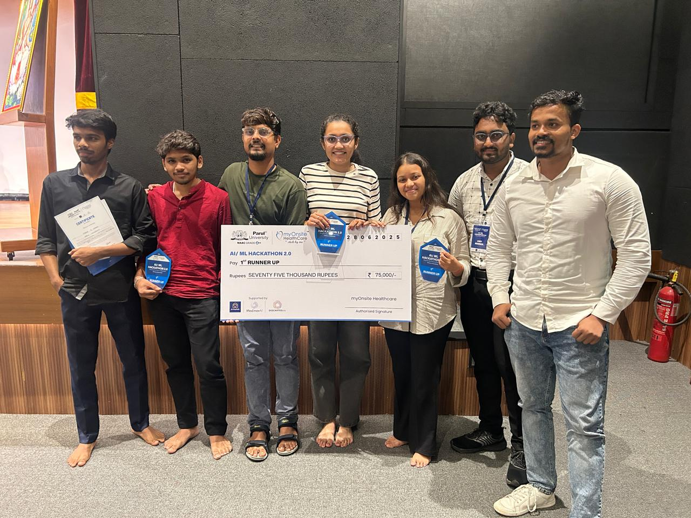

# 🚀 SafeMeds — AI-Powered Drug Interaction Checker
# 🥈 **1st Runner-Up |🏆 **AI/ML Hackathon 2.0 by Parul University, myOnsite Healthcare & byteXL**

## 📸 Imgs :




[](https://react.dev/)
[](https://flask.palletsprojects.com/)
[](https://aws.amazon.com/)
[](https://groq.com/)
[](LICENSE)

---

## 📖 Overview
SafeMeds is a **real-time, AI-powered clinical decision support tool** that evaluates **drug-to-drug interactions** using **natural language queries**.  
It helps healthcare professionals **reduce medication risks** and **make faster, safer decisions**.

---

## 🧠 Tech Stack
**Frontend:** React.js (Vercel)  
**Backend:** Flask (Python, AWS EC2, Render)  
**AI Model:** LLaMA3-8B via Groq API  
**Deployment:** AWS, Vercel (Frontend), Custom Domain Setup  

---

## ✨ Features
- 🔎 **Natural Language Drug Queries**  
  Example: *"Can I take ibuprofen with metformin?"* → AI responds with safety analysis.  

- ⚙️ **Groq + LLaMA3 AI Integration**  
  State-of-the-art LLMs for clinical drug interaction interpretation.  

- 🖥️ **Clean & Responsive UI**  
  Optimized for clarity and accessibility for healthcare professionals.  

- 🌐 **Full Stack Deployment**  
  Scalable cloud infrastructure with integrated frontend & backend.

---

## 👨‍💻 Team Roles
| Name | Role |
|------|------|
| **Marka S Charan** [🔗 GitHub](https://github.com/MARKASCHARAN) • [🔗 LinkedIn](https://linkedin.com/in/markascharan) | Full Stack Developer, Integration|
| **Dhrumin Upadhyay** [🔗 GitHub](https://github.com/dhrumin-upadhyay) • [🔗 LinkedIn](https://www.linkedin.com/in/dhrumin-upadhyay-98b021287/) | Machine learning|
| **Nidhi Thakore** [🔗 GitHub](https://github.com/nidhi-thakore) • [🔗 LinkedIn](https://www.linkedin.com/in/nidhi-thakore-10b9b825b/) | AWS Deployment, Domain Setup |
| **Ayushi Majumdar** [🔗 GitHub](https://github.com/ayushi-majumdar) • [🔗 LinkedIn](https://www.linkedin.com/in/ayushi-majumdar-4318152a1/) | UI/UX & Frontend Designer |


---

## 🛠️ Getting Started (Frontend)

```bash
# Clone the repository
git clone https://github.com/your-username/SafeMeds-Frontend.git
cd SafeMeds-Frontend

# Install dependencies
npm install

# Start development server
npm run dev
